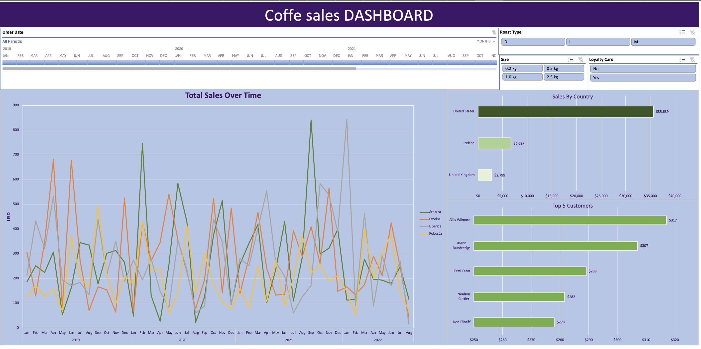

# ☕ Coffee Sales Dashboard

An interactive Excel dashboard project built to analyze coffee sales performance across different countries, roast types, customer segments, and product sizes.

---

## 📊 Dashboard Features

- Sales trend analysis over time

- Country-wise sales comparison

- Top 5 customers analysis

- Roast type filtering

- Loyalty card customer segmentation

- Product size filtering

- Interactive slicers and timeline controls

---

## 🛠 Tools Used

- Microsoft Excel

- Pivot Tables

- Pivot Charts

- Slicers

- Timeline Filters

- Data Visualization

---

## 📈 Key Insights

- United States generated the highest sales revenue.

- Dark roast coffee performed strongly across multiple periods.

- Loyalty card customers contributed significantly to repeat purchases.

- Certain customers consistently generated high revenue.

---

## 📷 Dashboard Preview

---

## 📂 Dataset

The dataset contains:

- Order Date

- Roast Type

- Product Size

- Customer Information

- Country-wise Sales

- Loyalty Card Data

---

## 🚀 Purpose of Project

This project was created to practice:

- Data analysis

- Business intelligence reporting

- Dashboard design

- Excel data visualization

---

## 👨‍💻 Author

Akhil Reddy  

Mechanical Engineering Student at IIT Bhubaneswar  

Interested in Data Analytics, AI/ML, and Tech
